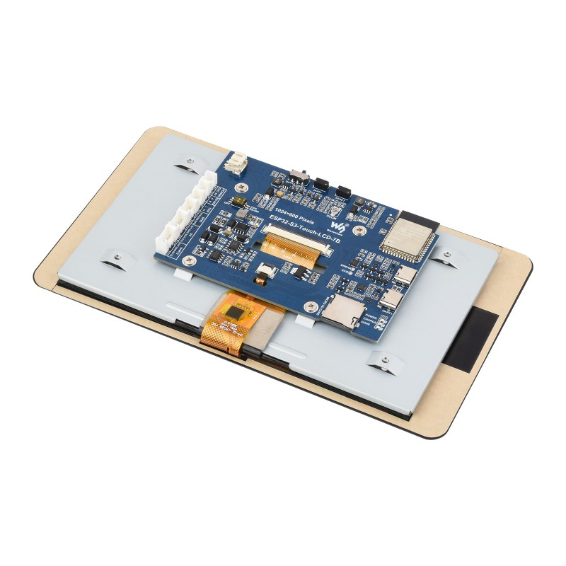

# Smart Home Control Panel (ESP32-S3-Touch-LCD-7)

An intelligent smart home control panel based on **ESPHome** and **LVGL**. This project is optimized for the 7-inch high-definition touchscreen, providing a smooth user interface and deep integration with Home Assistant.



## 🛠 Technical Specifications

*   **Controller**: ESP32-S3 (Dual-core, 240MHz).
*   **Memory**: 16MB Flash, 8MB Octal PSRAM.
*   **Display**: 7" IPS, 1024x600 resolution, RGB (DPI) interface.
*   **Touch Sensor**: GT911 (Capacitive, I2C).
*   **Peripherals**: Built-in **CH32V003** port expander (manages display reset, touchscreen reset, and backlight brightness).
*   **Power**: Li-ion battery support with voltage monitoring via the expander's built-in ADC.

## 📡 Integrations

*   **Home Assistant**: Full sensor synchronization (climate, power consumption, lighting).
*   **MUST Inverter**: Monitoring solar generation and battery status.
*   **Smart MAIC**: Three-phase power monitoring with local total power/current calculation on the ESP32.
*   **Security**: Integration with the Ukrainian air raid alert system.

## 📌 Pinout

### Display (RGB DPI)
| Signal | ESP32-S3 Pins |
| :--- | :--- |
| **Red** | GPIO1, 2, 42, 41, 40 |
| **Green** | GPIO39, 0, 45, 48, 47, 21 |
| **Blue** | GPIO14, 38, 18, 17, 10 |
| **Sync/Clock** | HSYNC: 46, VSYNC: 3, PCLK: 7, DE: 5 |

### Touch Sensor & I2C Bus
*   **SDA**: GPIO08
*   **SCL**: GPIO09
*   **INT (Touch)**: GPIO4 (Used to fix the I2C address to 0x5D).
*   **Reset (Touch)**: Pin 1 on the CH32V003 expander.

### CH32V003 Port Expander (I2C)
*   **Pin 1**: Touchscreen Reset.
*   **Pin 3**: Display Reset.
*   **PWM**: Backlight brightness control (inverted).
*   **ADC**: Battery voltage monitoring.

## 🏗 Project Architecture

The project has a modular structure for easy maintenance:
*   `panel-s3.yaml` — Main configuration file (hardware, sensors, system logic).
*   `gui.yaml` — LVGL style definitions and layer structure.
*   `base_logic.yaml` — Shared resources (fonts, Material Design icons).
*   `config/panel/` — A set of YAML files for each interface page.
*   `simulator.yaml` — Configuration for running the UI on a PC via SDL.

## 💡 Implementation Details (Knowledge Base)

### 1. Touchscreen I2C Address Fix (GT911)
The GT911 controller selects its I2C address when released from Reset based on the state of the INT pin. To prevent the touchscreen from "dropping out" after flashing, a hard reset sequence is implemented in the `on_boot` block:
```cpp
gpio_set_level(GPIO_NUM_4, 0); // Pull INT to Ground
vTaskDelay(pdMS_TO_TICKS(50)); // Wait for initialization
```
This guarantees the address `0x5D`.

### 2. Brightness Synchronization
Display brightness is controlled via `float` (0.0–1.0), while the LVGL slider uses `int` (0–100). For correct display after reboot, a multiplier of 100 is used in the slider's value lambda and forced synchronization occurs in the settings page's `on_show` trigger.

### 3. Local Power Calculation
To minimize latency and increase accuracy, the summation of three-phase power consumption (MAIC) occurs locally on the ESP32 in `template` sensors with robust `NaN` value handling.

### 4. Navigation Sync & Visual Feedback
The bottom navigation bar uses a `buttonmatrix`. To provide visual feedback, the `CHECKED` state is styled with a subtle blue background (`0x103E5C`) and a `2px` green top border. Since ESPHome doesn't natively sync `buttonmatrix` states with active pages, a custom C++ block in the 1s interval handles this:
*   Sets buttons to `CHECKABLE` on boot.
*   Updates the `CHECKED` flag based on `id(page_xxx).is_showing()`.

### 5. "Power Off" (Sleep) Shortcut
The clock icon in the footer acts as an instant sleep button. When pressed, it:
1.  Switches to the `page_watch`.
2.  Forces `idle_counter` to `0`.
3.  Immediately sets backlight brightness to `3%` (night mode).
This bypasses the standard idle timeout and provides a quick way to dim the display.

## 🚀 Build and Flash

To compile and upload to the device:
```bash
esphome run panel-s3.yaml
```

To run the simulator (requires SDL2 library installed):
```bash
esphome run simulator.yaml
```
